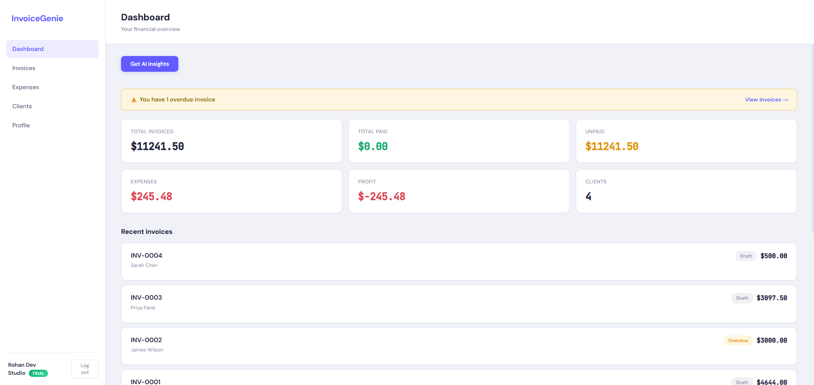
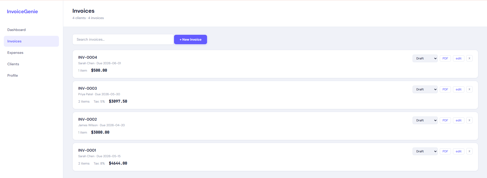
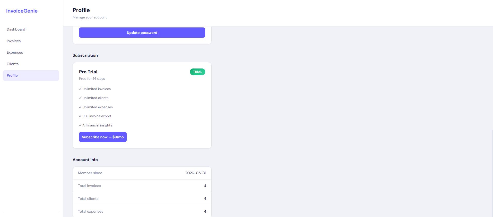

# InvoiceGenie

**AI-powered invoice & expense management for freelancers and small businesses.**

Built as a full-stack SaaS product with real authentication, Stripe payments, AI-powered insights, and production AWS deployment.

### [🚀 Live Demo →](http://invoicegenie-frontend-rohan.s3-website-us-east-1.amazonaws.com)



---

## Features

**Core**
- User authentication with JWT + bcrypt (signup/login with validation)
- Client management — full CRUD with search & filter
- Invoice creation with dynamic line items, tax calculation, and status tracking
- Expense tracking with 9 categories and date management
- Payment recording — auto-created when invoices are marked as "Paid"

**AI-Powered (Groq — Llama 3.3 70B)**
- Financial insights — analyzes your income, expenses, and invoices to generate actionable advice
- Auto-categorize expenses — type a description and AI selects the right category

**Billing & Monetization**
- Three-tier subscription system: Free → Trial (14 days) → Pro ($9/mo)
- Stripe Checkout integration for payments
- Stripe Customer Portal for subscription management
- Feature gating — free users have limits on invoices, clients, expenses, PDF exports, and AI features

**Dashboard**
- 6 metric cards: Total Invoiced, Total Paid, Unpaid, Expenses, Profit, Clients
- Income vs Expenses bar chart (last 6 months)
- Overdue invoice detection with warning banner
- Recent invoices list with color-coded status badges
- Expenses breakdown by category

**Other**
- PDF invoice export with professional layout
- User profile with editable name, email, business name, currency preference
- Password change functionality
- Search & filter across invoices, expenses, and clients
- Multi-tenant — all data isolated per user

---

## Screenshots

### Invoices


### Profile & Subscription


---

## Tech Stack

| Layer | Technology |
|-------|-----------|
| Frontend | React 18 + Vite |
| Backend | Express.js (Node.js) |
| Database | PostgreSQL (AWS RDS) |
| AI | Groq API (Llama 3.3 70B) |
| Payments | Stripe (Checkout + Customer Portal) |
| Auth | JWT + bcrypt |
| Hosting | AWS EC2 (backend) + S3 (frontend) |
| Process Manager | PM2 |

---

## AWS Architecture

```
┌─────────────────────────────────────────────────────────┐
│                      Users (Browser)                     │
└─────────────────────┬───────────────────────────────────┘
                      │
          ┌───────────┴───────────┐
          │                       │
          ▼                       ▼
┌─────────────────┐    ┌─────────────────────┐
│   S3 Bucket     │    │   EC2 (t3.micro)    │
│   Static React  │    │   Express.js + PM2  │
│   Frontend      │    │   Backend API       │
└─────────────────┘    └────────┬────────────┘
                                │
                    ┌───────────┼───────────┐
                    │           │           │
                    ▼           ▼           ▼
          ┌──────────────┐ ┌────────┐ ┌─────────┐
          │ RDS Postgres │ │ Groq   │ │ Stripe  │
          │ (db.t3.micro)│ │ API    │ │ API     │
          │ 20GB SSD     │ │ (free) │ │         │
          └──────────────┘ └────────┘ └─────────┘

All services on AWS Free Tier:
- EC2 t3.micro: 750 hrs/mo
- RDS db.t3.micro: 750 hrs/mo + 20GB storage
- S3: 5GB storage
```

---

## Database Schema

```
users          clients         invoices         expenses        payments
─────          ───────         ────────         ────────        ────────
id (PK)        id (PK)         id (PK)          id (PK)         id (PK)
name           user_id (FK)    user_id (FK)     user_id (FK)    user_id (FK)
email          name            client_id (FK)   amount          invoice_id (FK)
password       email           invoice_number   category        amount
business_name  phone           status           description     method
currency       company         due_date         date            date
plan           created_at      items (JSONB)    created_at      created_at
stripe_id                      subtotal
created_at                     tax_rate
                               total
                               notes
                               created_at
```

## Local Development

### Prerequisites
- Node.js 20+
- PostgreSQL (or use SQLite version on `sqlite` branch)

### Backend
```bash
cd backend
npm install
# Create .env with required variables (see below)
node server.js
# Runs on http://localhost:8000
```

### Frontend
```bash
cd frontend
npm install
npm run dev
# Runs on http://localhost:5173
```

### Environment Variables
```env
JWT_SECRET=your-jwt-secret
GROQ_API_KEY=your-groq-api-key
STRIPE_SECRET_KEY=sk_test_your-stripe-key
STRIPE_PRICE_ID=price_your-price-id
STRIPE_PUBLISHABLE_KEY=pk_test_your-publishable-key
DB_HOST=localhost
DB_USER=invoicegenie
DB_PASSWORD=your-db-password
DB_NAME=invoicegenie
```

---

## Subscription Plans

| Feature | Free | Trial (14 days) | Pro ($9/mo) |
|---------|------|-----------------|-------------|
| Invoices | 5 | Unlimited | Unlimited |
| Clients | 3 | Unlimited | Unlimited |
| Expenses | 10 | Unlimited | Unlimited |
| PDF Export | Limited | Unlimited | Unlimited |
| AI Insights | Locked | Included | Included |
| AI Categorize | Free | Free | Free |
| Dashboard | Free | Free | Free |

---

## Project Structure

```
invoicegenie/
├── backend/
│   ├── server.js          ← Entire backend (Express + PostgreSQL)
│   ├── package.json
│   └── .env               ← API keys (not in repo)
├── frontend/
│   ├── src/
│   │   ├── App.jsx        ← Entire frontend (React)
│   │   ├── main.jsx
│   │   └── style.css      ← All styles (CSS variables)
│   ├── index.html
│   └── package.json
├── screenshots/
│   ├── screenshot-dashboard.png
│   ├── screenshot-invoices.png
│   └── screenshot-profile.png
└── README.md
```

---

## Skills Demonstrated

- Full-stack JavaScript (React + Express)
- PostgreSQL relational database design (5 tables with foreign keys)
- JWT authentication with bcrypt password hashing
- RESTful API design (20+ endpoints)
- LLM integration (Groq API for financial analysis)
- Stripe payment integration (Checkout + Customer Portal + Webhooks)
- PDF generation (PDFKit)
- AWS deployment (EC2 + RDS + S3)
- Multi-tenant SaaS architecture
- Responsive UI with CSS custom properties

---
Built from scratch as a portfolio project demonstrating production-grade full-stack SaaS development.
